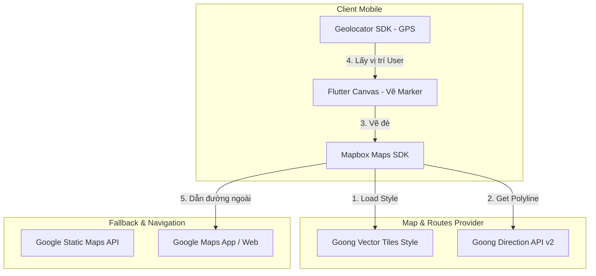

# Tài Liệu Đặc Tả Kỹ Thuật: Bản Đồ và Markers (Map & Markers Specification)

Tài liệu này đặc tả chi tiết kiến trúc, cơ chế tải bản đồ (Load Map), cách thức khởi tạo, vẽ động và xử lý tương tác của các biểu tượng đánh dấu vị trí (Markers) trên bản đồ trong dự án **GP Travel Advisor**.

---

## 1. Tổng Quan (Overview)

### 1.1. Mục đích tài liệu
Tài liệu này cung cấp thông tin kỹ thuật về cách thức tích hợp bản đồ và lập trình vẽ các Markers động trên ứng dụng di động GP Travel Advisor. Tài liệu đóng vai trò làm chuẩn kết nối và phát triển giữa:
- **Ứng dụng di động (Flutter Client):** Xử lý vẽ giao diện Markers bằng Canvas, tích hợp Mapbox SDK, và xử lý tương tác của người dùng.
- **Dịch vụ máy chủ (NestJS Backend):** Cấu trúc và cung cấp dữ liệu tọa độ địa lý cùng thông tin hoạt động lịch trình cần thiết.

### 1.2. Phạm vi
- **Mobile Client:** Flutter App (`GPTravelAdvisorMobile` và `GPTravelAdvisorMobile_version2`).
- **Backend API:** NestJS App (`GP-Travel-Advisor-Backend`).

---

## 2. Kiến Trúc Tải Bản Đồ (Map Load Architecture)

Hệ thống GP Travel Advisor sử dụng giải pháp kết hợp đa nền tảng để tối ưu hóa hiển thị, chi phí và cung cấp trải nghiệm chỉ đường tốt nhất tại Việt Nam.



### 2.1. Bộ Dựng Hình Bản Đồ (Map Engine)
Ứng dụng sử dụng **Mapbox Maps SDK cho Flutter** (`mapbox_maps_flutter`) làm nền tảng hiển thị bản đồ tương tác. Mapbox đảm nhiệm việc hiển thị các lớp bản đồ vector, xoay góc nhìn, thu phóng và quản lý lớp phủ đánh dấu (`PointAnnotationManager`).

### 2.2. Nhà Cung Cấp Bản Đồ & Định Vị (Map & Location Provider)
- **Goong Maps Service:** Sử dụng Goong làm nhà cung cấp chính tại Việt Nam nhằm đảm bảo hiển thị tên đường, số nhà và địa danh chính xác bằng tiếng Việt.
  - **Map Style URL:** Bản đồ tương tác được cấu hình nạp Style URL từ Goong: `https://tiles.goong.io/assets/goong_map_web.json?api_key={GOONG_MAPTILES_KEY}`.
  - **Tuyến đường di chuyển (Routing):** Khi hiển thị lịch trình di chuyển thực tế, ứng dụng gọi API Goong Direction v2:
    `https://rsapi.goong.io/v2/direction?origin={start}&destination={end}&vehicle=car&api_key={GOONG_API_KEY}`
    Dữ liệu Polyline trả về sẽ được giải mã (decode) và vẽ đè lên bản đồ Mapbox dưới dạng đường nối tuyến đi thực tế.
- **Google Maps Service (Dự phòng & Tiện ích ngoại biên):**
  - **Static Maps:** Sử dụng Google Static Maps API hoặc Goong Static Maps API làm ảnh tĩnh hiển thị nhanh trên các thẻ tóm tắt lịch trình (Itinerary Cards) để tránh tiêu thụ lưu lượng tải bản đồ đầy đủ không cần thiết.
  - **Dẫn đường ngoài (External Navigation):** Khi người dùng nhấn nút **"Bắt đầu dẫn đường"**, ứng dụng sẽ kích hoạt chuyển hướng URL Scheme tới ứng dụng Google Maps cài sẵn trên thiết bị (hoặc trình duyệt web ngoài):
    `https://www.google.com/maps/search/?api=1&query={name}, {latitude},{longitude}`

---

## 3. Các Loại Marker & Cơ Chế Vẽ Động (Marker Types & Dynamic Rendering)

Nhằm tối ưu hóa hiển thị sắc nét trên mọi mật độ điểm ảnh (Retina, Super Retina, v.v.) và tránh việc phải chuẩn bị hàng trăm tệp ảnh tĩnh PNG/SVG cho từng số thứ tự hay màu sắc lịch trình, toàn bộ Markers trên bản đồ được **vẽ động thời gian thực (Dynamic Canvas Rendering)** thông qua API đồ họa của Flutter.

### 3.1. Lớp Vẽ Động (Custom Painters & Canvas API)
Sử dụng `ui.PictureRecorder` và `Canvas` để tạo luồng vẽ vector, sau đó xuất ra mảng byte dạng PNG (`Uint8List`) để nạp vào Mapbox Point Annotation.

Dưới đây là đặc tả chi tiết 5 loại Marker đang được sử dụng trong hệ thống:

---

### 3.2. Đặc Tả Chi Tiết 5 Loại Marker

#### 1. Marker Điểm Hoạt Động Thường (Regular Itinerary Activity Marker)
* **Hình dáng:** Vòng tròn 2D đổ bóng 3D, viền trắng dày, hiển thị số thứ tự hoạt động ở giữa tâm.
* **Màu sắc nền (Trạng thái hoạt động):**
  - **Màu Xanh dương hệ thống (`#1A6EBD`):** Dành cho hoạt động sắp diễn ra (chưa đi).
  - **Màu Xanh lá cây (`#10B981`):** Dành cho hoạt động đã hoàn thành (Trạng thái `daDi`).
* **Thông số vẽ trên Canvas:**
  - *Kích thước Canvas:* $128 \times 128$ pixels.
  - *Bóng đổ:* Vẽ vòng tròn tại tọa độ $(64, 68)$ với bán kính $52\text{ px}$, màu `Colors.black.withOpacity(0.3)`.
  - *Vòng tròn nền:* Vẽ vòng tròn tại tọa độ $(64, 64)$ với bán kính $48\text{ px}$, tô kín (fill) bằng màu trạng thái (xanh dương hoặc xanh lá).
  - *Vòng viền trắng:* Vẽ vòng tròn tại tọa độ $(64, 64)$ với bán kính $48\text{ px}$, nét viền (`strokeWidth = 6`), màu trắng.
  - *Chữ số thứ tự:* Hiển thị chữ số ở tâm bằng `TextPainter`, font chữ `FontWeight.bold`, kích thước chữ $48\text{ px}$, màu trắng.

#### 2. Marker Khách Sạn / Điểm Nghỉ Chân (Hotel Marker)
* **Hình dáng:** Vòng tròn nền màu Teal đặc trưng của hệ thống lưu trú, chứa biểu tượng chiếc giường (Hotel Icon) ở giữa.
* **Điều kiện hiển thị:** Hoạt động có thời gian bắt đầu và kết thúc trùng nhau (`startTime == endTime`) và thuộc danh mục lưu trú hoặc tiêu đề chứa các từ khóa: `"khách sạn"`, `"hotel"`, `"lưu trú"`.
* **Thông số vẽ trên Canvas:**
  - *Kích thước Canvas:* $128 \times 128$ pixels.
  - *Vòng tròn nền:* Bán kính $50\text{ px}$ màu **Teal (`#0F766E`)**.
  - *Vòng viền trắng:* Bán kính $50\text{ px}$, nét viền (`strokeWidth = 6`), màu trắng.
  - *Biểu tượng ở tâm:* Vẽ ký tự Unicode của `Icons.hotel_rounded` (`\uE31B`) với kích thước biểu tượng $52\text{ px}$, màu trắng.

#### 3. Marker Chế Độ Xem "Tất Cả Các Ngày" (All-days View Markers)
Khi người dùng bật chế độ hiển thị đồng thời hoạt động của tất cả các ngày trong lịch trình (Show All Days), bản đồ sẽ hiển thị Marker đa sắc để phân biệt:
* **Marker hoạt động thường:**
  - *Nội dung chữ:* Hiển thị định dạng `D{Day}.{Index}` (Ví dụ: `D1.1` - Ngày 1 Điểm 1, `D2.3` - Ngày 2 Điểm 3).
  - *Màu nền:* Chọn tự động theo ngày từ bảng màu tuần hoàn `kDayColors`:
    1. Ngày 1: Xanh dương nhạt (`#1A6EBD`)
    2. Ngày 2: Cam (`#E67E22`)
    3. Ngày 3: Tím (`#9B59B6`)
    4. Ngày 4: Đỏ (`#E74C3C`)
    5. Ngày 5: Xanh ngọc (`#1ABC9C`)
    6. Ngày 6: Vàng cam (`#F39C12`)
    7. Ngày 7: Xanh đen (`#2C3E50`)
  - *Kích thước chữ:* Thu nhỏ xuống $28\text{ px}$ để chứa vừa nội dung. Viền ngoài trắng mỏng hơn (`strokeWidth = 5`).
* **Marker khách sạn:**
  - *Nền:* Giữ màu xanh Teal lưu trú (`#0F766E`).
  - *Viền ngoài:* Không viền trắng, thay thế bằng viền màu tương ứng với ngày du lịch (`color` lấy từ `kDayColors` tương ứng).
  - *Nhãn phụ:* Vẽ nhãn ngày dạng `D1`, `D2` ở phần bên dưới biểu tượng khách sạn (tọa độ $y=88$, cỡ chữ $18\text{ px}$).

#### 4. Marker Vị Trí Hiện Tại Của Người Dùng (Current User Location Marker)
* **Hình dáng:** Hiệu ứng định vị phát sóng (Radar Halo Marker) nổi trên lớp bản đồ chính.
* **Thông số vẽ trên Canvas:**
  - *Hào quang ngoài (Halo effect):* Vòng tròn màu xanh dương nhạt mờ tại $(64, 64)$ bán kính $48\text{ px}$ với độ mờ $20\%$ (`#1A6EBD.withOpacity(0.2)`).
  - *Vòng tương phản:* Vòng tròn bán kính $24\text{ px}$ màu trắng tinh.
  - *Tâm định vị:* Vòng tròn bán kính $18\text{ px}$ màu xanh dương đậm (`#1A6EBD`).
  - *Kích thước hiển thị:* Trên bản đồ Mapbox, Marker này được đặt hệ số co giãn hiển thị `iconSize = 1.5` để tăng độ nhận diện thị giác.

#### 5. Marker Ghim Vị Trí Trên Bottom Sheet (Single Place Marker)
* **Hình dáng:** Marker dạng pin điểm định danh tối giản, hiển thị khi mở bản đồ xem nhanh của một địa điểm cụ thể trên Bottom Sheet.
* **Thông số vẽ trên Canvas:**
  - *Nền vòng ngoài:* Bán kính $42\text{ px}$ màu trắng.
  - *Vòng tròn màu hệ thống:* Bán kính $34\text{ px}$ màu Xanh dương (`#1A6EBD`).
  - *Chấm tâm:* Vòng tròn bán kính $16\text{ px}$ màu trắng.

---

## 4. Luồng Hoạt Động & Vòng Đời (Workflows & Lifecycle)

### 4.1. Luồng Cấp Quyền & Định Vị Vị Trí Người Dùng
1. Khi màn hình bản đồ khởi chạy (`initState`), phương thức `_getCurrentLocation()` được gọi.
2. Ứng dụng gọi gói `geolocator` để kiểm tra quyền truy cập vị trí của thiết bị:
   - Nếu quyền bị từ chối (`LocationPermission.denied`), ứng dụng sẽ hiển thị hộp thoại yêu cầu cấp quyền từ hệ điều hành.
   - Nếu người dùng từ chối cấp quyền, ứng dụng bỏ qua bước vẽ vị trí hiện tại và chỉ tập trung camera vào các điểm lịch trình.
3. Nếu quyền được chấp thuận:
   - Bước 1: Gọi `getLastKnownPosition()` để lấy tọa độ gần nhất giúp hiển thị nhanh chóng.
   - Bước 2: Gọi `getCurrentPosition(accuracy: LocationAccuracy.high)` để lấy tọa độ có độ chính xác cao nhất từ GPS.
   - Mỗi lần lấy được vị trí mới, ứng dụng sẽ thực hiện gọi `setState` cập nhật biến `_userPosition` và thông báo tới người dùng bằng `SnackBar`.

### 4.2. Khởi Tạo Bản Đồ & Vẽ Lớp Phủ (Initialization & Rendering)
1. Widget `MapWidget` được dựng lên với URL phong cách Goong (`styleUri`).
2. Kích hoạt callback `onMapCreated` lưu trữ thực thể điều khiển bản đồ `mapboxMap`.
3. Kích hoạt sự kiện `onStyleLoadedListener`:
   - Tạo trình quản lý Marker: `_pointAnnotationManager = await _mapboxMap?.annotations.createPointAnnotationManager()`.
   - Đăng ký bộ lắng nghe sự kiện click: `_pointAnnotationManager?.addOnPointAnnotationClickListener(this)`.
   - Gọi hàm cập nhật nội dung: `_updateMapContent()`.

### 4.3. Cập Nhật Marker & Camera
Hàm `_updateMapContent()` thực hiện các bước sau:
1. Xóa toàn bộ Marker hiện tại: `_pointAnnotationManager?.deleteAll()`.
2. Dọn sạch cấu trúc ánh xạ ID: `_annotationIdMap.clear()`.
3. Duyệt danh sách các địa điểm hoạt động:
   - Kiểm tra xem địa điểm có tọa độ `latitude` và `longitude` hợp lệ hay không.
   - Kiểm tra chế độ xem: Nếu `_showAllDays = true` thì chạy vòng lặp duyệt qua tất cả các ngày và tạo Marker đa sắc (`D1.1`, `D2.1`...). Nếu `_showAllDays = false` chỉ tạo Marker cho ngày hiện tại (Số thứ tự `1`, `2`, `3`...).
   - Đẩy Marker lên bản đồ bằng hàm `_pointAnnotationManager?.create(PointAnnotationOptions)`.
   - Lưu trữ mối liên hệ giữa ID của Marker vừa tạo trên bản đồ và ID của hoạt động lịch trình trong bộ nhớ RAM qua map `_annotationIdMap[marker.id] = activity.id`.
4. Vẽ Marker vị trí hiện tại của người dùng (nếu có `_userPosition`) đè lên trên cùng.
5. **Tự động cân chỉnh Camera (Zoom-to-Fit):**
   - Thu thập tất cả các điểm lịch trình và điểm vị trí hiện tại của người dùng.
   - Gọi hàm `_mapboxMap?.cameraForCoordinates(cameraPoints, MbxEdgeInsets(top: 120, left: 60, bottom: 220, right: 60))` để tính toán khung nhìn chứa vừa vặn tất cả các điểm.
   - Thực hiện di chuyển camera mượt mà đến vùng đích: `_mapboxMap?.easeTo(CameraOptions, MapAnimationOptions(duration: 1000))`.

### 4.4. Xử Lý Tương Tác Nhấn (Marker Tap Interaction)
- Lớp giao diện bản đồ thực thi giao diện lắng nghe `OnPointAnnotationClickListener`.
- Khi người dùng chạm vào một Marker, hàm `onPointAnnotationClick(PointAnnotation annotation)` được tự động kích hoạt.
- Hàm thực hiện tra cứu: `final activityId = _annotationIdMap[annotation.id]`.
- Nếu tìm thấy ID hoạt động tương ứng, kích hoạt callback `widget.onMarkerTap?.call(activityId)`. Màn hình cha tiếp nhận sự kiện này sẽ cuộn Timeline đến đúng thẻ hoạt động đó hoặc mở Bottom Sheet hiển thị thông tin chi tiết của địa điểm du lịch tương ứng.

---

## 5. Đặc Tả Dữ Liệu Tích Hợp API (API Data Integration)

Để bản đồ Client hiển thị chính xác các Markers du lịch, API phản hồi lịch trình từ Backend du lịch (`GP-Travel-Advisor-Backend`) cần đảm bảo cung cấp đầy đủ các thuộc tính cấu trúc địa lý của từng hoạt động du lịch:

### 5.1. Định dạng JSON Dữ Liệu Lịch Trình (Trích mẫu)
```json
{
  "id": "itinerary_day_01_activity_02",
  "title": "Chùa Linh Ứng Bán Đảo Sơn Trà",
  "latitude": 16.10052,
  "longitude": 108.27798,
  "category": "Tham quan, tôn giáo",
  "startTime": "09:00",
  "endTime": "11:30",
  "status": "daDi"
}
```

### 5.2. Bảng Mô Tả Thuộc Tính Dữ Liệu

| Trường Dữ Liệu | Kiểu Dữ Liệu | Yêu Cầu | Mô Tả & Tác Động Giao Diện |
| :--- | :--- | :--- | :--- |
| `id` | `String` (UUID/Text) | **Bắt buộc** | Định danh duy nhất của hoạt động. Dùng để Client ánh xạ sự kiện chạm vào Marker sang hiển thị chi tiết hoạt động tương ứng. |
| `title` | `String` | **Bắt buộc** | Tên địa điểm du lịch. Dùng hiển thị nhãn, gửi truy vấn dẫn đường sang ứng dụng ngoài hoặc hiển thị tiêu đề trên Bottom Sheet. |
| `latitude` | `Double` | **Bắt buộc** | Vĩ độ vật lý trên bản đồ. Nếu giá trị bị `null`, ứng dụng sẽ tự động loại bỏ hoạt động đó khỏi bản đồ để tránh lỗi. |
| `longitude` | `Double` | **Bắt buộc** | Kinh độ vật lý trên bản đồ. Nếu giá trị bị `null`, ứng dụng sẽ tự động loại bỏ hoạt động đó khỏi bản đồ để tránh lỗi. |
| `category` | `String` | Tùy chọn | Danh mục phân loại hoạt động. Dùng để xác định và vẽ **Hotel Marker** (nếu từ khóa trùng khớp với các mẫu lưu trú). |
| `startTime` | `String` | **Bắt buộc** | Giờ bắt đầu hoạt động dưới định dạng `HH:mm`. Phối hợp với `endTime` để phát hiện điểm lưu trú cố định (Khách sạn khởi đầu ngày). |
| `endTime` | `String` | **Bắt buộc** | Giờ kết thúc hoạt động dưới định dạng `HH:mm`. Phối hợp với `startTime` để phát hiện điểm lưu trú cố định. |
| `status` | `String / Enum` | **Bắt buộc** | Trạng thái của hoạt động. Nhận một trong các giá trị của `ActivityStatus` (Ví dụ: `daDi`, `sapDi`). Quyết định màu nền của Marker thường (xanh lá cây hoặc xanh dương). |
