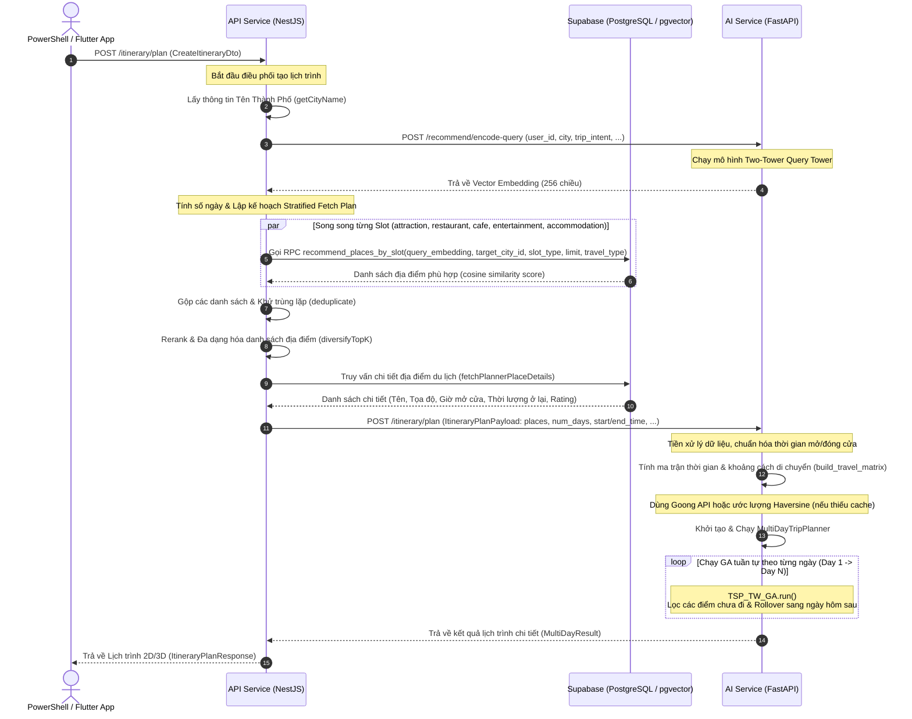

# Tài Liệu Kiến Trúc Hệ Thống Toàn Diện (System Architecture)

Tài liệu này cung cấp cái nhìn toàn cảnh về kiến trúc tích hợp, luồng xử lý dữ liệu và thuật toán tối ưu hóa lịch trình du lịch của dự án GP Travel Advisor. Hệ thống kết hợp giữa **mô hình học sâu Two-Tower** để tìm kiếm địa điểm phù hợp và **Thuật toán Di truyền (Genetic Algorithm - GA)** để sắp xếp lịch trình tối ưu.

---

## 1. Bản Đồ Tổng Quan & Sơ Đồ Hoạt Động (Workflow Diagram)

Luồng hoạt động của hệ thống được chia làm hai giai đoạn chính:
1. **Retrieval Phase (Giai đoạn Tìm kiếm):** Sử dụng mô hình Two-Tower của AI Service và tìm kiếm pgvector trên Supabase để lọc ra danh sách địa điểm phù hợp với sở thích của người dùng.
2. **Scheduling Phase (Giai đoạn Sắp xếp):** Dùng thuật toán di truyền (GA) của AI Service để xếp thứ tự đi các địa điểm theo ngày/giờ, tối ưu hóa thời gian di chuyển và thời gian tham quan.

### 1.1. Sơ Đồ Trình Tự Lập Lịch Trình (Sequence Diagram)



---

## 2. Chi Tiết Luồng Chạy 9 Bước (Step-by-Step Flow)

### Bước 1: Tiếp nhận yêu cầu từ Client
* **Thư mục:** `./api-service`
* **Tệp tin:** `src/modules/itinerary/itinerary.controller.ts` -> hàm `plan` (route `POST /itinerary/plan`)
* **Đầu vào:** `CreateItineraryDto` (Chứa: `destinationLocationId`, `tripIntent`, `startDate`, `endDate`, `dailyStartTime`, `dailyEndTime`, `userId`).
* **Nhiệm vụ:** Nhận yêu cầu và chuyển tiếp sang `RecommendationService`.

### Bước 2: Truy vấn tên thành phố
* **Thư mục:** `./api-service`
* **Tệp tin:** `src/modules/recommendation/recommendation.service.ts` -> hàm `getCityName`
* **Nhiệm vụ:** Kết nối với Supabase, truy vấn tên thành phố từ bảng `cities` dựa trên `destinationLocationId` gửi lên.
* **Đầu ra:** Chuỗi ký tự tên thành phố (Ví dụ: `"Đà Nẵng"`).

### Bước 3: Mã hóa yêu cầu thành Vector (Two-Tower)
* **Tệp tin gửi:** `./api-service/src/modules/recommendation/ml-client.service.ts` -> hàm `encodeQuery`
* **Tệp tin nhận:** `./ai-service/app/api/routes/recommend.py` -> route `POST /recommend/encode-query`
* **Nhiệm vụ:** NestJS gọi HTTP sang FastAPI. FastAPI nạp thông tin vào mô hình deep learning **Query Tower** để trả ra vector biểu diễn ngữ cảnh chuyến đi.
* **Đầu ra:** Vector embedding 256 số thực.

### Bước 4: Tìm kiếm địa điểm tương đồng trên DB (Supabase pgvector)
* **Thư mục:** `./api-service`
* **Tệp tin:** `src/modules/recommendation/recommendation.service.ts` -> hàm `retrieveCandidates` (gọi `fetchBySlot` song song).
* **Nhiệm vụ:** Gọi hàm database RPC `recommend_places_by_slot` trên Supabase cho từng loại slot (attraction, restaurant, cafe...). Supabase thực hiện tính khoảng cách Cosine giữa Vector truy vấn và Vector của tất cả địa điểm du lịch.
* **Đầu ra:** Danh sách các ứng viên kèm theo điểm số tương đồng `cosine_score`.

### Bước 5: Khử trùng lặp và đa dạng hóa địa điểm (MMR Rerank)
* **Thư mục:** `./api-service`
* **Tệp tin:** `src/modules/recommendation/utils/mmr-rerank.ts` -> hàm `diversifyTopK`
* **Nhiệm vụ:** Loại bỏ trùng lặp địa điểm. Phân bổ chỉ tiêu số lượng (budget/quota) cho từng nhóm địa điểm dựa trên `tripIntent` (chủ đề chuyến đi) và số ngày đi để chọn ra tối đa 20 hoặc 60 địa điểm phù hợp nhất.

### Bước 6: Lấy chi tiết thông tin địa điểm
* **Thư mục:** `./api-service`
* **Tệp tin:** `src/modules/recommendation/recommendation.service.ts` -> hàm `fetchPlannerPlaceDetails`
* **Nhiệm vụ:** Truy vấn bảng `travel.places` của Supabase để lấy tọa độ vật lý, giờ mở cửa nén (`open_hour_compressed`), thời gian ở lại mặc định và rating của 20 địa điểm rút gọn từ Bước 5.
* **Đầu ra:** Danh sách POIs đầy đủ thông tin để gửi cho GA.

### Bước 7: Gửi danh sách POIs sang GA Planner
* **Tệp tin gửi:** `./api-service/src/modules/recommendation/ml-client.service.ts` -> hàm `planItinerary`
* **Tệp tin nhận:** `./ai-service/app/api/routes/itinerary.py` -> route `POST /itinerary/plan`
* **Nhiệm vụ:** NestJS gửi HTTP POST chứa danh sách địa điểm chi tiết sang FastAPI để chạy lập lịch trình tối ưu.

### Bước 8: Chạy thuật toán tối ưu hóa GA (TSP-TW GA)
* **Thư mục:** `./ai-service`
* **Tệp tin:** `./ai-service/app/services/itinerary_service.py` và `./ai-service/app/services/itinerary/planner.py`
* **Lớp:** `MultiDayTripPlanner` và `TSP_TW_GA`
* **Nhiệm vụ:**
  1. Tính toán ma trận thời gian và khoảng cách di chuyển giữa các điểm bằng Haversine.
  2. Chạy thuật toán di truyền di chuyển nhiều ngày, tự động chuyển tiếp (rollover) các điểm không kịp đi hôm nay sang ngày tiếp theo.
* **Đầu ra:** Kết quả lịch trình dạng JSON hoàn chỉnh chia theo ngày và khung giờ di chuyển/ở lại chi tiết.

### Bước 9: Trả kết quả về Client
* **Thư mục:** `./api-service`
* **Tệp tin:** `src/modules/itinerary/itinerary.controller.ts`
* **Nhiệm vụ:** Nhận kết quả từ FastAPI và phản hồi HTTP Response về Client (PowerShell Terminal hoặc ứng dụng Flutter).

---

## 3. Bản Đồ File & Hàm Hệ Thống (File & Function Registry)

### 3.1. API Service (NestJS - api-service)
Chịu trách nhiệm tiếp nhận yêu cầu từ Client, thực hiện tìm kiếm lọc địa điểm phù hợp trong Database Supabase và điều phối luồng chạy.

* **`src/modules/itinerary/itinerary.controller.ts`**:
  * `plan()`: Điểm đón đầu tiên của route `POST /itinerary/plan`.
* **`src/modules/recommendation/recommendation.service.ts`**:
  * `planItinerary()`: Điều phối luồng, kết nối các bước.
  * `retrieveCandidates()`: Lấy candidates theo nhóm slot từ Supabase.
  * `fetchBySlot()`: Gọi RPC database `recommend_places_by_slot`.
  * `fetchPlannerPlaceDetails()`: Lấy thông tin tọa độ/giờ mở cửa chi tiết.
* **`src/modules/recommendation/ml-client.service.ts`**:
  * `encodeQuery()`: Gọi HTTP `/recommend/encode-query` lấy vector.
  * `planItinerary()`: Gọi HTTP `/itinerary/plan` gửi danh sách GA lập lịch.
* **`src/modules/recommendation/utils/mmr-rerank.ts`**:
  * `diversifyTopK()`: Rerank, khử trùng lặp và đa dạng hóa candidates theo quota.

### 3.2. AI Service (FastAPI - ai-service)
Chịu trách nhiệm thực thi các tính toán học máy và thuật toán tối ưu hóa di truyền (GA).

* **`app/api/routes/recommend.py`**:
  * Route `/recommend/encode-query`: Chạy mô hình học sâu Two-Tower.
* **`app/api/routes/itinerary.py`**:
  * Route `/itinerary/plan`: Điểm đón yêu cầu lập lịch trình.
* **`app/services/itinerary_service.py`**:
  * `plan_itinerary()`: Chuẩn hóa dữ liệu đầu vào và gọi bộ lập lịch.
* **`app/services/itinerary/planner.py`**:
  * `build_travel_matrix()`: Xây dựng ma trận thời gian di chuyển.
  * `TSP_TW_GA`: Chạy GA cho 1 ngày (lớp lõi GA).
  * `MultiDayTripPlanner`: Phối hợp GA lập lịch nhiều ngày và rollover POI chưa đi.

---

## 4. Chi Tiết Thuật Toán GA Lập Lịch Trình (TSP-TW Algorithm Core)

Lõi thuật toán nằm tại file `./ai-service/app/services/itinerary/planner.py`.

### 4.1. Thiết Kế Mã Hóa Nhiễm Sắc Thể (Chromosome Representation)
Nhiễm sắc thể là một danh sách hoán vị các chỉ số của địa điểm tham quan (POI indices).
* Ví dụ: Một nhiễm sắc thể `[2, 0, 3, 1]` tương ứng với lộ trình đi địa điểm có index 2 -> index 0 -> index 3 -> index 1.

### 4.2. Giả Lập Lịch Trình (Schedule Simulation)
Trong hàm `_objective(chromosome)`, bộ lập lịch duyệt qua lộ trình và tính toán:
1. **Thời gian di chuyển thực tế:** `Travel Time = Raw Travel Time + Buffer Time`. Buffer mặc định 20% thời gian chạy xe (tối thiểu 5 phút, tối đa 15 phút) hoặc theo P90/P95 dữ liệu trễ lịch sử.
2. **Thời điểm đến nơi:** `Arrival Time = Current Time + Travel Time`.
3. **Thời gian chờ:** Nếu đến trước giờ mở cửa (`Arrival Time < open_time`), du khách chờ `Wait Time = open_time - Arrival Time`.
4. **Thời điểm rời đi:** `Departure Time = Arrival Time + Wait Time + visit_duration`.
5. **Ăn trưa:** Địa điểm ăn trưa (`restaurant`) bắt buộc phải bắt đầu trong khung giờ vàng từ 11:30 đến 13:30.

### 4.3. Cơ Chế Greedy Fit & Rollover
* Nếu bật `greedy_fit=True`, thuật toán kiểm tra xem việc đi tiếp (cộng thời gian về khách sạn) có vượt quá giờ kết thúc ngày du lịch (`daily_end_time`, ví dụ 21:00) hay không.
* Nếu vượt quá, địa điểm đó sẽ bị loại khỏi lịch trình ngày hôm đó để tránh du khách bị mệt.
* Địa điểm bị bỏ lại sẽ được tự động **rollover** (chuyển tiếp) sang ngày hôm sau trong lớp `MultiDayTripPlanner`.

### 4.4. Hàm Fitness (Hàm Mục Tiêu)
Hàm fitness hướng tới việc lấp đầy thời gian tham quan hữu ích, giảm thiểu thời gian di chuyển/chờ rỗng, phạt nặng các vi phạm đóng cửa và ăn trưa:

```
Fitness = |Available Time - Invested Time| + (0.1 * Total Travel Time) + (0.3 * Total Wait Time) + Meal Penalty + Time Window Penalty
```

* **Fitness càng nhỏ càng tốt** (bài toán cực tiểu hóa).
* **Time Window Penalty:** Phạt `2 * (Arrival Time - close_time)` cho mỗi phút đến sau khi địa điểm đóng cửa.
* **Meal Penalty:** Phạt rất nặng (10,000 điểm) nếu ngày đó không sắp xếp được ít nhất một bữa ăn trưa hợp lệ.

---

## 5. Nguyên Tắc Tích Hợp Hệ Thống (Integration Principles)

Để giảm thiểu xung đột mã nguồn (merge conflict) và cô lập lỗi giữa các phần, hệ thống tuân thủ nghiêm ngặt các nguyên tắc sau:
1. **Không sửa đổi logic Two-Tower:** Endpoint `/recommend/encode-query` và model weights của Two-Tower được giữ nguyên.
2. **Không sửa đổi RPC recommendation:** Giữ nguyên hàm database RPC `recommend_places_by_slot`.
3. **Không sửa đổi schema Supabase:** Không thay đổi cấu trúc bảng `places` hay các bảng liên quan trong schema `travel`.
4. **Không sửa đổi dependencies bừa bãi:** Tránh thay đổi package trong `requirements.txt` hay `package-lock.json` nếu không bắt buộc cho GA.
5. **Cô lập tích hợp:** API Service (NestJS) làm điều phối: nhặt candidates từ retrieval -> lấy chi tiết -> gửi sang endpoint GA `/itinerary/plan` -> nhận kết quả và trả về cho Client.
