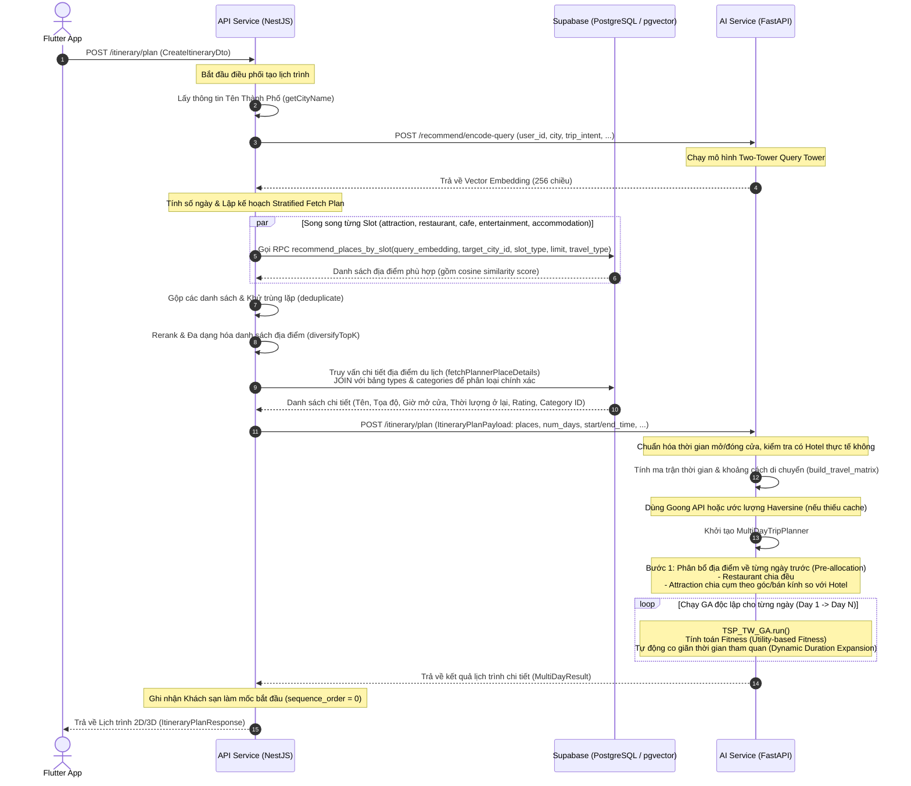

# Tài Liệu Kiến Trúc Hệ Thống Toàn Diện (System Architecture) - Phiên Bản 2 (Daily GA + Pre-allocation)

Tài liệu này cung cấp cái nhìn toàn cảnh về kiến trúc tích hợp, luồng xử lý dữ liệu và thuật toán tối ưu hóa lịch trình du lịch của dự án GP Travel Advisor. Hệ thống kết hợp giữa **mô hình học sâu Two-Tower** để tìm kiếm địa điểm phù hợp và **Thuật toán Di truyền (Genetic Algorithm - GA) cải tiến** để sắp xếp lịch trình tối ưu.

---

## 1. Bản Đồ Tổng Quan & Sơ Đồ Hoạt Động (Workflow Diagram)

Luồng hoạt động của hệ thống được chia làm hai giai đoạn chính:
1. **Retrieval Phase (Giai đoạn Tìm kiếm):** Sử dụng mô hình Two-Tower của AI Service và tìm kiếm pgvector trên Supabase để lọc ra danh sách địa điểm phù hợp với sở thích của người dùng.
2. **Scheduling Phase (Giai đoạn Sắp xếp):** Phân bổ địa điểm theo ngày dựa trên khoảng cách địa lý và chạy thuật toán di truyền (GA) của AI Service độc lập cho từng ngày để xếp thứ tự đi, tối ưu hóa thời gian di chuyển, thời gian chờ và thứ hạng địa điểm (rank).

### 1.1. Sơ Đồ Trình Tự Lập Lịch Trình (Sequence Diagram)



---

## 2. Chi Tiết Luồng Chạy 9 Bước (Step-by-Step Flow)

### Bước 1: Tiếp nhận yêu cầu từ Client
* **Thư mục:** `./api-service`
* **Tệp tin:** `src/modules/itinerary/itinerary.controller.ts` -> hàm `plan` (route `POST /itinerary/plan`)
* **Đầu vào:** `CreateItineraryDto` (Chứa: `destinationLocationId`, `tripIntent`, `startDate`, `endDate`, `dailyStartTime`, `dailyEndTime`, `userId`).
* **Nhiệm vụ:** Nhận yêu cầu và chuyển tiếp sang `RecommendationService`.

### Bước 2: Truy vấn tên thành phố
* **Thư mục:** `./api-service`
* **Tệp tin:** `src/modules/recommendation/recommendation.service.ts` -> hàm `getCityName`
* **Nhiệm vụ:** Kết nối với Supabase, truy vấn tên thành phố từ bảng `cities` dựa trên `destinationLocationId` gửi lên.
* **Đầu ra:** Chuỗi ký tự tên thành phố (Ví dụ: `"Đà Nẵng"`).

### Bước 3: Mã hóa yêu cầu thành Vector (Two-Tower)
* **Tệp tin gửi:** `./api-service/src/modules/recommendation/ml-client.service.ts` -> hàm `encodeQuery`
* **Tệp tin nhận:** `./ai-service/app/api/routes/recommend.py` -> route `POST /recommend/encode-query`
* **Nhiệm vụ:** NestJS gọi HTTP sang FastAPI. FastAPI nạp thông tin vào mô hình deep learning **Query Tower** để trả ra vector biểu diễn ngữ cảnh chuyến đi.
* **Đầu ra:** Vector embedding 256 số thực.

### Bước 4: Tìm kiếm địa điểm tương đồng trên DB (Supabase pgvector)
* **Thư mục:** `./api-service`
* **Tệp tin:** `src/modules/recommendation/recommendation.service.ts` -> hàm `retrieveCandidates` (gọi `fetchBySlot` song song).
* **Nhiệm vụ:** Gọi hàm database RPC `recommend_places_by_slot` trên Supabase cho từng loại slot (attraction, restaurant, cafe...). Supabase thực hiện tính khoảng cách Cosine giữa Vector truy vấn và Vector của tất cả địa điểm du lịch.
* **Đầu ra:** Danh sách các ứng viên kèm theo điểm số tương đồng `cosine_score`.

### Bước 5: Khử trùng lặp và đa dạng hóa địa điểm (MMR Rerank)
* **Thư mục:** `./api-service`
* **Tệp tin:** `src/modules/recommendation/utils/mmr-rerank.ts` -> hàm `diversifyTopK`
* **Nhiệm vụ:** Loại bỏ trùng lặp địa điểm. Phân bổ chỉ tiêu số lượng (budget/quota) cho từng nhóm địa điểm dựa trên `tripIntent` (chủ đề chuyến đi) và số ngày đi để chọn ra tối đa 20 hoặc 60 địa điểm phù hợp nhất.

### Bước 6: Lấy chi tiết thông tin địa điểm & Phân loại chính xác
* **Thư mục:** `./api-service`
* **Tệp tin:** `src/modules/recommendation/recommendation.service.ts` -> hàm `fetchPlannerPlaceDetails`
* **Nhiệm vụ:** Truy vấn bảng `travel.places` JOIN với bảng `types` và `categories` của Supabase để lấy tọa độ vật lý, giờ mở cửa nén (`open_hour_compressed`), thời gian ở lại mặc định và rating.
* **Logic xử lý:** Phân loại chính xác nhóm địa điểm du lịch bằng hàm `resolvePlannerPlaceType` dựa trên ID và Tên danh mục (ví dụ: gán nhãn `restaurant` cho các điểm ẩm thực, `hotel` cho các điểm lưu trú, `attraction` cho điểm tham quan).
* **Yêu cầu bắt buộc:** Phải tồn tại ít nhất 1 địa điểm lưu trú (`hotel`) thực tế do người dùng chọn hoặc được tìm thấy từ kết quả truy vấn, nếu không hệ thống sẽ báo lỗi.

### Bước 7: Gửi danh sách POIs sang GA Planner
* **Tệp tin gửi:** `./api-service/src/modules/recommendation/ml-client.service.ts` -> hàm `planItinerary`
* **Tệp tin nhận:** `./ai-service/app/api/routes/itinerary.py` -> route `POST /itinerary/plan`
* **Nhiệm vụ:** NestJS gửi HTTP POST chứa danh sách địa điểm chi tiết sang FastAPI để chạy lập lịch trình tối ưu.

### Bước 8: Chạy thuật toán tối ưu hóa GA cải tiến (TSP-TW GA)
* **Thư mục:** `./ai-service`
* **Tệp tin:** `./ai-service/app/services/itinerary_service.py` và `./ai-service/app/services/itinerary/planner.py`
* **Lớp:** `MultiDayTripPlanner` và `TSP_TW_GA`

### Bước 9: Phối hợp lưu trữ và Trả kết quả về Client
* **Thư mục:** `./api-service`
* **Tệp tin:** `src/modules/itinerary/itinerary.service.ts` và `itinerary.controller.ts`
* **Nhiệm vụ:** 
  * NestJS nhận kết quả từ FastAPI.
  * Tự động thêm Khách sạn làm mốc xuất phát đầu ngày (với `sequence_order = 0`, `duration_minutes = 0` và `is_locked = true`).
  * Lưu toàn bộ bản ghi lịch trình vào bảng `itinerary_details` trên Supabase và trả phản hồi về Client.

---

## 3. Bản Đồ File & Hàm Hệ Thống (File & Function Registry)

### 3.1. API Service (NestJS - api-service)
* **`src/modules/itinerary/itinerary.service.ts`**:
  * `createGeneratedItinerary()`: Phối hợp lưu kết quả lịch trình chi tiết vào cơ sở dữ liệu.
  * `buildHotelDetailRow()`: Tạo bản ghi xuất phát tại khách sạn lúc đầu ngày (`sequence_order = 0`).
  * `optimizeDayRoute()`: Tối ưu lộ trình một ngày lẻ bằng cách gọi FastAPI `/itinerary/optimize` (lọc bỏ điểm khách sạn `sequence_order = 0` trước khi gửi đi để tránh bị xáo trộn).
* **`src/modules/recommendation/recommendation.service.ts`**:
  * `resolvePlannerPlaceType()`: Ánh xạ chuẩn hóa phân loại địa điểm (`hotel`, `restaurant`, `attraction`) dựa vào danh mục trên DB.

### 3.2. AI Service (FastAPI - ai-service)
* **`app/services/itinerary/planner.py`**:
  * `_allocate_pois_by_day()`: Phân bổ trước địa điểm vào từng ngày theo cụm địa lý (góc/bán kính) đến Khách sạn và chia đều các quán ăn.
  * `TSP_TW_GA`: Chạy bộ lập lịch GA độc lập trên từng ngày dựa vào số điểm mục tiêu `target_poi_count`.

---

## 4. Chi Tiết Thuật Toán GA Lập Lịch Trình (TSP-TW Algorithm Core)

Lõi thuật toán nằm tại file `./ai-service/app/services/itinerary/planner.py`.

### 4.1. Thiết Kế Mã Hóa Nhiễm Sắc Thể (Chromosome Representation)
Nhiễm sắc thể là một danh sách hoán vị các chỉ số của địa điểm tham quan (POI indices) thuộc ngày đó.
* Ví dụ: Một nhiễm sắc thể `[2, 0, 3, 1]` tương ứng với lộ trình đi địa điểm có index 2 -> index 0 -> index 3 -> index 1 trong tập con địa điểm được phân bổ riêng cho ngày đó.

### 4.2. Phân Bổ Địa Điểm Theo Ngày (Pre-allocation)
Hệ thống sử dụng thuật toán **TOPTW Pre-allocation** để phân bổ toàn bộ địa điểm ứng viên vào từng ngày trước khi chạy GA:
1. **Phân chia nhà hàng:** Phân bổ đều các quán ăn (`restaurant`) vào các ngày dựa trên thứ hạng (rank) để đảm bảo mỗi ngày có điểm ăn uống.
2. **Phân chia điểm tham quan (Geographic Clustering):** Sắp xếp và phân bổ các điểm tham quan (`attraction`) về các ngày dựa trên cự ly khoảng cách địa lý và hướng di chuyển (góc radian/bán kính) so với Khách sạn làm tâm. Các địa điểm nằm cùng hướng sẽ được ưu tiên xếp vào cùng một ngày.
3. **Cân bằng tải:** Tự động cân bằng số lượng điểm giữa các ngày, cam kết không có ngày nào bị trống địa điểm (Empty Day).

### 4.3. Giả Lập Lịch Trình & Co Giãn Thời Gian (Dynamic Duration Expansion)
Trong quá trình giả lập lịch trình của nhiễm sắc thể:
1. **Tính toán thời gian**: `Thời điểm đến = Thời điểm xuất phát chặng trước + Thời gian di chuyển (gồm 20% buffer)`.
2. **Co giãn thời gian tham quan động (Dynamic Duration Expansion)**: Thay vì bắt du khách đứng chờ địa điểm mở cửa hoặc tạo ra các khoảng thời gian rảnh rỗi (idle time) vô ích, thuật toán sẽ tự động cộng dồn thời gian chờ/thời gian rảnh này vào **thời lượng tham quan thực tế** tại địa điểm hiện tại (đảm bảo thời lượng thực tế $\ge$ thời lượng mặc định trên DB, tối đa thêm 60 - 120 phút). Điều này giúp lịch trình khít thời gian trên UI một cách tự nhiên.
3. **Giới hạn cuối ngày**: Nếu thời điểm rời khỏi địa điểm cộng thêm chặng quay về khách sạn vượt quá giờ giới hạn kết thúc ngày (ví dụ: 21:00), địa điểm đó và các điểm phía sau trong chromosome sẽ không được xếp lịch cho ngày hôm đó nữa.

### 4.4. Hàm Fitness tối ưu hóa Tiện ích (Utility-based Fitness)
Hàm fitness hướng tới tối thiểu hóa chi phí tiện ích âm của lộ trình (tương đương tối đa hóa sự hài lòng của du khách):

```
Fitness = Feasibility Penalty + Cost_travel - Sum of Utility_i
```

Trong đó:
*   **Feasibility Penalty (Phạt vi phạm ràng buộc cứng):**
    *   Phạt vi phạm khung giờ đóng cửa: `TW_penalty = 100,000` cho mỗi địa điểm trễ giờ.
    *   Phạt thiếu bữa ăn trưa hợp lệ (11:30 - 13:30): `Meal_penalty = 100,000`.
*   **Cost_travel (Chi phí di chuyển):**
    *   `Cost_travel = 0.5 * Total Travel Time (phút)`. (Thể hiện sự mệt mỏi của du khách khi đi đường).
*   **Utility_i (Tiện ích tích cực của địa điểm i):**
    *   `Utility_i = 100 * (0.7 * R_i + 0.3 * Rating_norm_i)`
    *   `R_i = 1.0 - (rank_i / N)`: Độ ưu tiên từ mô hình Two-Tower & MMR.
    *   `Rating_norm_i = Rating_i / 5.0`: Điểm chất lượng đánh giá cộng đồng.

---

## 5. Nguyên Tắc Tích Hợp Hệ Thống (Integration Principles)

Để giảm thiểu xung đột mã nguồn và cô lập lỗi giữa các phần, hệ thống tuân thủ nghiêm ngặt các nguyên tắc sau:
1. **Không sửa đổi logic Two-Tower:** Endpoint `/recommend/encode-query` và model weights của Two-Tower được giữ nguyên.
2. **Không sửa đổi RPC recommendation:** Giữ nguyên hàm database RPC `recommend_places_by_slot`.
3. **Sử dụng cấu trúc phân tầng rõ ràng:** NestJS chịu trách nhiệm tiền xử lý phân loại thực thể (`resolvePlannerPlaceType`) và hậu xử lý lưu dữ liệu, AI Service chịu trách nhiệm thuần túy về thuật toán tối ưu.

---

## 6. Yêu Cầu Tái Cấu Trúc Chi Tiết (Prompt cho Code Agent)

Dưới đây là đặc tả yêu cầu chi tiết để chuyển đổi sang kiến trúc **GA theo Ngày (Daily GA + Pre-allocation)**:

### 6.1. Mục tiêu
Hãy thực hiện chỉnh sửa mã nguồn của phân hệ AI Service (FastAPI) để chuyển đổi lõi thuật toán lập lịch trình từ cơ chế "GA toàn cục + Rollover" sang cơ chế **"Phân cụm trước + Chạy GA độc lập theo Ngày (Daily GA + Pre-allocation)"** kết hợp **Tối ưu hóa Tiện ích (Utility-based)** và **Tự động co giãn thời gian tham quan**.

Các tệp tin cần tập trung chỉnh sửa:
- `ai-service/app/services/itinerary/planner.py` (Lõi chính)
- `ai-service/app/services/itinerary_service.py` (Điều hướng đầu vào/đầu ra)
- `ai-service/app/schemas/itinerary.py` (Cấu trúc payload đầu vào nếu cần thiết)

### 6.2. Chi Tiết Thực Hiện

#### Bước 1: Thuật toán gom cụm & phân bổ trước địa điểm (Pre-allocation)
Trong lớp `MultiDayTripPlanner`, trước khi bắt đầu vòng lặp chạy GA, hãy thực hiện phân bổ danh sách toàn bộ `attractions` và `restaurants` ứng viên vào từng ngày ($1 \dots \text{num\_days}$):
1. **Phân bổ nhà hàng (`restaurant`)**:
   - Phân chia đều các nhà hàng vào các ngày dựa trên thứ hạng (rank) để đảm bảo mỗi ngày có đúng 1 điểm ăn uống (nếu đủ số lượng).
2. **Phân bổ điểm tham quan (`attraction`)**:
   - Sử dụng khoảng cách địa lý (tọa độ GPS) so với Khách sạn làm tâm.
   - Sắp xếp và phân nhóm các điểm tham quan về các ngày sao cho các điểm cùng cụm/cùng hướng địa lý (ví dụ: chia theo vòng bán kính hoặc góc radian so với Khách sạn) sẽ được xếp vào cùng một ngày nhằm giảm thiểu thời gian di chuyển.
3. **Cân bằng tải (Load Balancing)**:
   - Đảm bảo số lượng điểm giữa các ngày không bị chênh lệch quá nhiều và không có ngày nào bị trống địa điểm (Empty Day).

#### Bước 2: Chạy GA độc lập theo từng ngày (Daily GA)
Thay vì sử dụng danh sách cuộn rollover như trước:
- Vòng lặp chính trong `MultiDayTripPlanner.run` sẽ duyệt qua từng ngày.
- Ở ngày $D$, gọi `TSP_TW_GA` chạy **chỉ trên danh sách địa điểm đã được phân bổ cho ngày $D$ ở Bước 1**.
- Các điểm không xếp được lịch trong ngày $D$ sẽ bị loại bỏ hoàn toàn (không đẩy sang ngày sau nữa).

#### Bước 3: Tự động co giãn thời gian tham quan (Dynamic Duration Expansion)
Trong quá trình giả lập lịch trình của GA (`_objective`):
- Nếu phát hiện thời gian rảnh rỗi (idle time) hoặc thời gian chờ đợi (wait time) trước khi di chuyển đến địa điểm tiếp theo hoặc trước khi quay về khách sạn cuối ngày:
- Thuật toán phải **tự động cộng thêm khoảng thời gian trống này vào thời lượng tham quan (visit_duration) của địa điểm hiện tại** (đảm bảo $\text{Thời lượng thực tế} \ge \text{visit\_duration}$ mặc định trên DB, có thể cấu hình giới hạn cộng thêm tối đa từ 60 - 120 phút).
- Điều này giúp lịch trình khít thời gian trên UI mà không cần nhồi nhét quá nhiều địa điểm.

#### Bước 4: Hàm Fitness tối ưu hóa Tiện ích (Utility-based Fitness)
Thiết kế lại hàm mục tiêu Fitness của GA cho từng ngày theo hướng tối ưu hóa Tiện ích du khách (chuẩn TOPTW):
- **Công thức**: 
  $$Fitness = Feasibility\_penalty + (0.5 \times T_{\text{travel}}) - \sum_{i \in \text{visited}} Utility_i$$
- **Trong đó**:
  - $Feasibility\_penalty$: Phạt rất nặng ($10^5$) nếu vi phạm giờ đóng cửa hoặc thiếu bữa ăn trưa.
  - $T_{\text{travel}}$: Tổng thời gian di chuyển trong ngày (phút).
  - $Utility_i$: Điểm tiện ích của địa điểm $i$, tính bằng:
    $$Utility_i = 100 \times (0.7 \times R_i + 0.3 \times \frac{Rating_i}{5.0})$$
    Với $R_i = 1.0 - (\text{rank}_i / N_{\text{candidates}})$ (tính từ vị trí rank đề xuất của mô hình Two-Tower).

### 6.3. Yêu Cầu Kiểm Thử (Verification)
Sau khi thực hiện, hãy chạy file test hoặc chạy trực tiếp bằng dòng lệnh:
```powershell
python ai-service/app/services/itinerary/planner.py --days 3 --start 08:00 --end 21:00 --source csv --limit 15
```
Xác nhận tính chính xác của thuật toán phân cụm địa lý, tính toán thời lượng và tính đúng đắn của hàm Fitness tiện ích mới.
