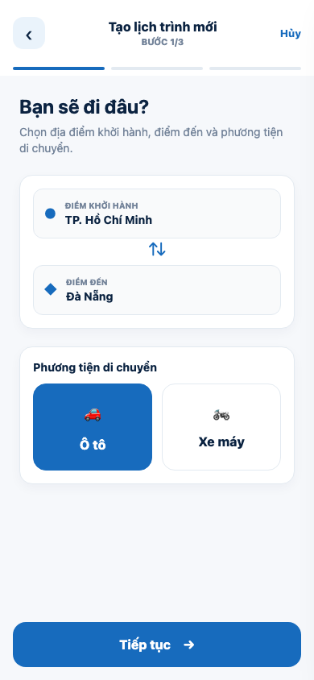
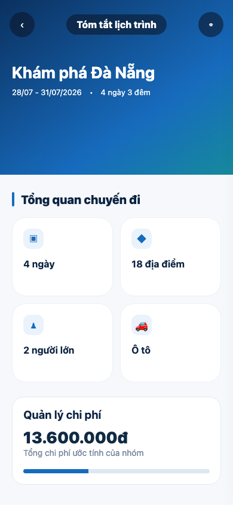
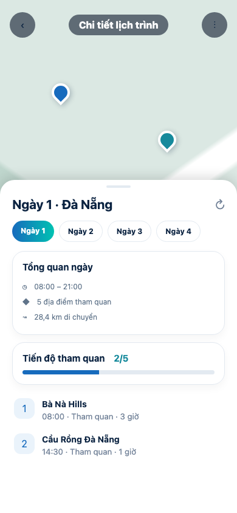

# Đồng bộ màu UI lịch trình

## Phạm vi

Đợt chỉnh sửa này chỉ đồng bộ màu cho ba màn:

1. Tạo lịch trình.
2. Tóm tắt lịch trình.
3. Chi tiết lịch trình.

Không thay đổi layout, spacing, kích thước component, nội dung, validation, điều hướng, Cubit, API hoặc backend.

## Màu được chuẩn hóa

| Thành phần | Màu sử dụng |
| --- | --- |
| Tiêu đề và text chính | `AppColors.premiumNavy` |
| CTA chữ nhật | `AppColors.primary` như nút ở trang Khám phá |
| Progress và trạng thái active | `AppColors.premiumBlue` |
| Text phụ và icon phụ | `AppColors.premiumMuted` |
| Nền màn hình | `AppColors.premiumBackground` |
| Nền app bar/surface | `AppColors.premiumSurface` |
| Border và drag handle | `AppColors.premiumBorder` |

## Tạo lịch trình

- Giữ nguyên bố cục ba bước hiện tại.
- Đồng bộ màu tiêu đề app bar và tiêu đề nội dung sang navy.
- Đồng bộ màu mô tả và số bước sang muted.
- Đồng bộ nút `Hủy`, thanh tiến trình và phương tiện đang chọn sang premium blue.
- Các CTA `Tiếp tục` và `Hoàn thành` dùng màu xanh đặc `AppColors.primary`.
- Đồng bộ nền footer với nền màn hình.
- Không thay đổi card, khoảng cách, vị trí trường nhập hoặc luồng chuyển bước.

## Tóm tắt lịch trình

- Giữ nguyên header, grid thống kê, các section và CTA.
- Đồng bộ nền màn hình sang `premiumBackground`.
- Đồng bộ thanh nhấn section sang `premiumBlue`.
- Đồng bộ tiêu đề `Tổng quan chuyến đi` sang `premiumNavy`.
- CTA `XEM CHI TIẾT LỊCH TRÌNH` dùng cùng màu xanh đặc với luồng tạo.
- Giữ nguyên phần quản lý chi phí đã chỉnh trước đó.

## Chi tiết lịch trình

- Giữ nguyên bản đồ toàn màn hình và draggable sheet.
- Đồng bộ nền scaffold với `premiumBackground`.
- Đồng bộ drag handle với `premiumBorder`.
- Đồng bộ icon refresh với `premiumMuted`.
- Không thay đổi bán kính, shadow, kích thước sheet, marker hoặc tracking.

## File đã chỉnh sửa

- `lib/features/trip_planner/presentation/screens/trip_planner_screen.dart`
- `lib/features/trip_planner/presentation/screens/trip_planner_step2_screen.dart`
- `lib/features/trip_planner/presentation/screens/trip_planner_step3_screen.dart`
- `lib/features/trip_planner/presentation/widgets/step_progress_bar.dart`
- `lib/features/trip_planner/presentation/widgets/transportation_selector.dart`
- `lib/features/itinerary/presentation/screens/itinerary_summary_screen.dart`
- `lib/features/itinerary/presentation/screens/itinerary_detail_screen.dart`

## Kiểm tra

- `dart format`: thành công.
- Flutter analyzer cho luồng tạo và tóm tắt lịch trình: `No issues found`.
- `git diff --check`: không có lỗi whitespace.

## Ghi chú ảnh

Ảnh được capture từ preview offline kích thước `390 × 844`, mô phỏng đúng bố cục hiện tại và các màu vừa đồng bộ. Preview không tải `.env`, không đăng nhập và không gửi request tới backend.
